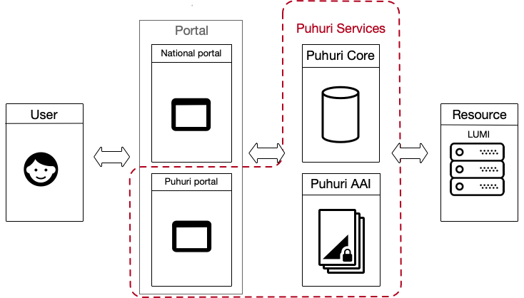
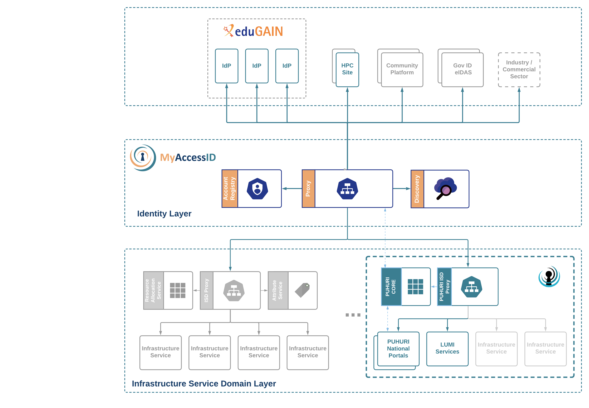
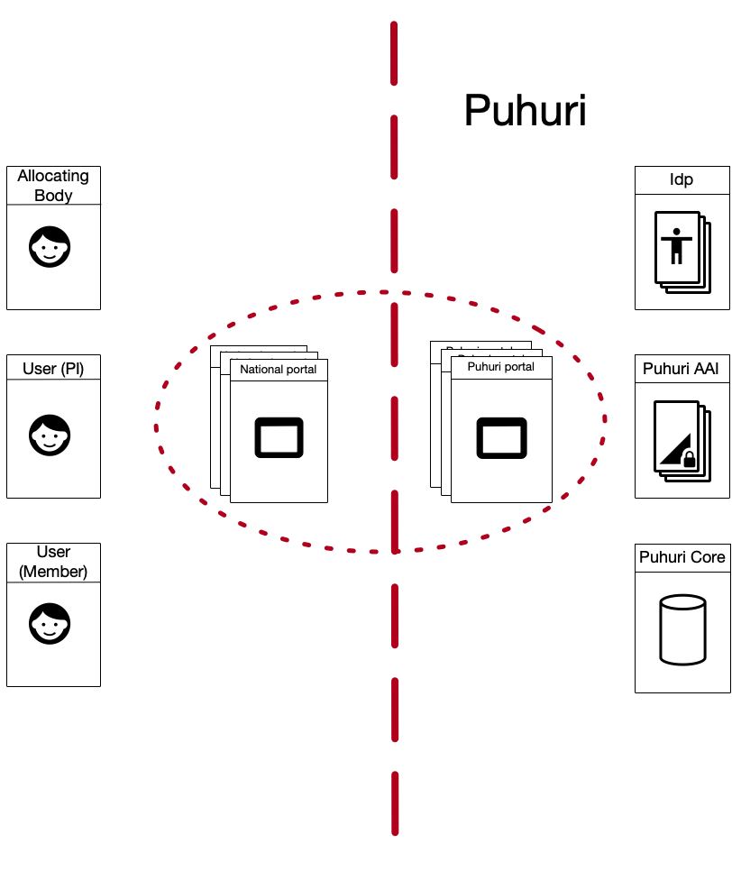
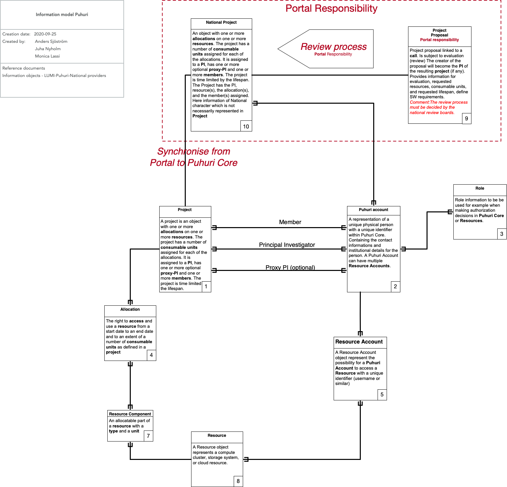

## Overview

This page introduces the Puhuri components and high level architecture. 

## Puhuri Components

The diagram above shows a high level architecture of Puhuri. Puhuri links together Users with strong digital identity
with Resources in a seamless way.

Puhuri is using MyAccessID AAI for user registration that can be started from National Portal of Resource Allocators
or from Puhuri Portal, which is provided as a reference solution. The registration process creates a unique identifier
(Community Unique Identifier, CUID) for the user, which is used for referencing and linking user identity across the
different components.

The identity provider releases the attributes about User’s identity and affiliation, which is important for the
resource providers to know. User can also register SSH public keys for easier access to the Linux-based systems that
are accessible in Puhuri. 

Puhuri Core is an API service for Resource Allocators that allows to manage Projects, Members (using CUID of Puhuri users)
as well as Resource Allocations. A Resource provider (in Figure above - LUMI) then imports the allocation and project
membership information from the Puhuri Core and sets up the services for access using MyAccessID user account. Resource
provider also reports on the usage of resource allocations as well as provides additional data, like Linux usernames, that
user might need in order to access the Resource.

Puhuri Core has an offline access to MyAccessID user registry and uses it for keeping user information up to date.

## Puhuri roles

User applies for a Resource Allocation and then manage the Members of the Project using a Puhuri Portal, hosted by University of Tartu, or via a National Portal, depending which solution is available for User.

The Resource application review process happens outside of Puhuri. The national portals are expected to push approved projects and resources  to Puhuri Core. The Principal Investigator (PI) creates project in the Puhuri Portal or National Portal. The submission is then accepted by the Resource Allocator, which is responsible for the particular application’s resource granting. Then the project information is propagated to Puhuri Core and from there synchronised to the Resource Provider. In addition to Project description and members, also the Resource-specific resource allocation attributes are included. 

A national portal may implement identity linking of local accounts with Puhuri AAI account. The recommended way for that is to use OIDC registration flow, which can be triggered from the national portal  and lead to  redirection back with a created Puhuri User CUID

## Puhuri model

Information model of Puhuri. Please note that the terminology used in this documentation differs occasionally of this planned information model. 
