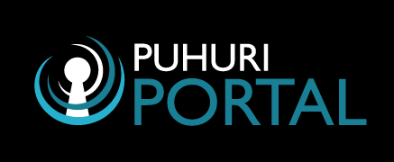

# Branding

## Logos

Puhuri logo:

[Download here](https://puhuri.neic.no/assets/Puhuri_logo-transp_bg.png)

Puhuri logo with NeIC:

[Download here](https://puhuri.neic.no/assets/Puhuri_neic_original_transparent-back.png)

Puhuri Portal logo for light background:

[Download here](https://puhuri.neic.no/assets/Puhuri_Portal_black.png)

Puhuri Portal logo for dark background:

[Download here](https://puhuri.neic.no/assets/Puhuri_Portal_white.png)

Puhuri Core logo for light background:

[Download here](https://puhuri.neic.no/assets/Puhuri_Core_black.png)

Puhuri Core logo for dark background:

[Download here](https://puhuri.neic.no/assets/Puhuri_Core_white.png)

## Logo guideline

Font and colors:

## License

Puhuri logos are published under a CC BY-NC-ND 4.0 license. The owner of the logos and copyright belongs to the University of Tartu.
