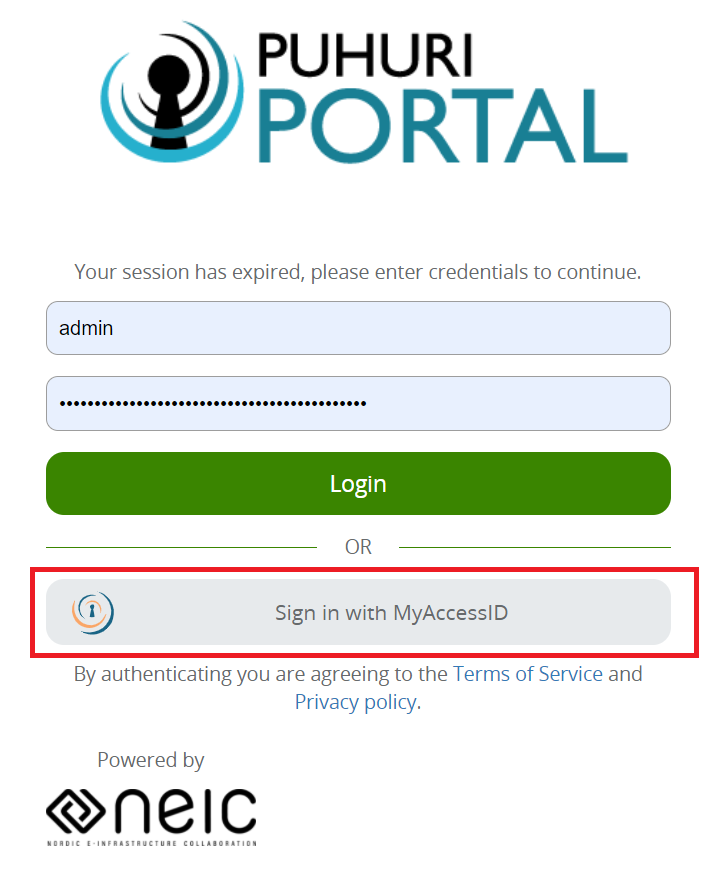
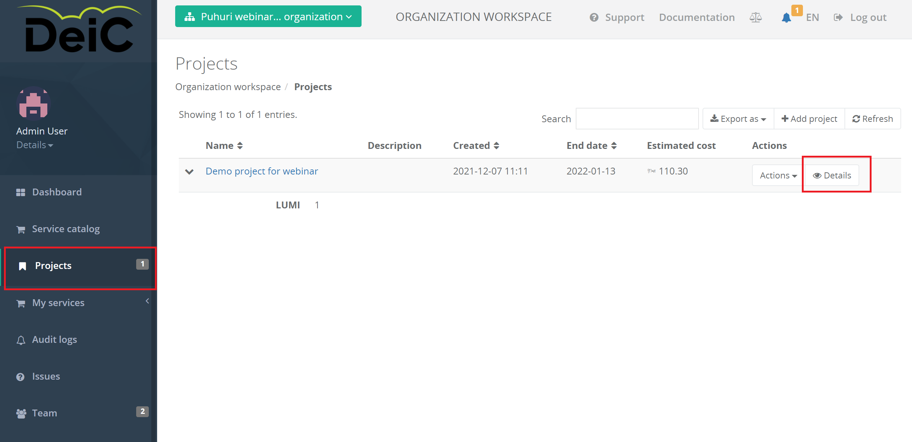

# User guide for modifying projects and allocations

!!! warning
    User guide is in development. Early feedback is welcome, send email to ilja.livenson@ut.ee.

### Only project PI or national allocator representative can send project and allocation modification requests. Only national allocation representative can approve these requests.

## To modify project allocation limits: 

1.Login to Puhuri Portal using MyAccessID.
   

2. Select organization and then project from the "Select workspace" list.
3. Select correct allocation you would like to change.

4. Select "Actions" and then "Change limits".

4. Set new limits and click "Submit".

5. Now national resource allocator has to approve the changes.

## To modify project information:

1.Login to Puhuri Portal using MyAccessID.
   

2. Select organization and then project from the "Select workspace" list.
3. Select "Projects" from the left side menu.
4. Select correct project and click "Details".

5. Update project data and "Update project details".

6. Now national resource allocator has to approve the changes.
