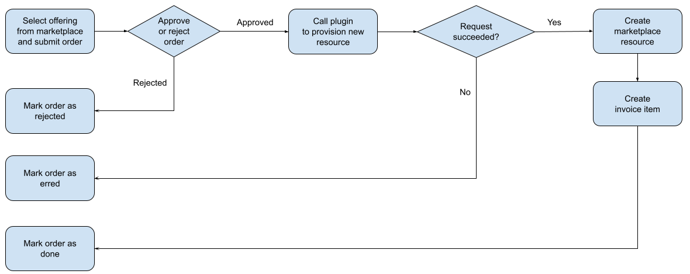
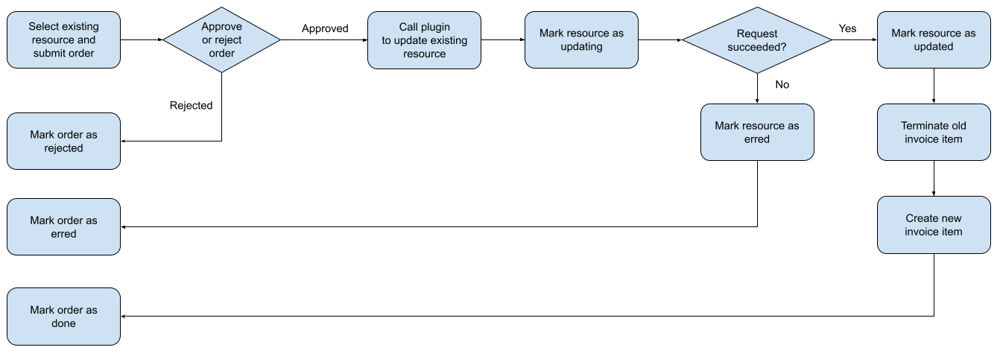

# Resource allocators
Allocators are external parties that are entitled to manage projects and resource allocations in Puhuri Core.
In the scope of Puhuri, resource allocators are typically organizations operating national portals or research communities.

Resource allocator is expected to:

1. Be eligible to share specific resources, e.g. LUMI share.
2. Be aware of the Researcher Access identifiers of the users, aka CUIDs.

## Terminology

Puhuri Core is based on [Waldur](https://github.com/waldur/waldur-mastermind/) orchestrator and as such some of the APIs
use a different naming than agreed in Puhuri. Below is a mapping to reduce confusion.

| Puhuri      | API / Waldur    |
| ----------- | --------------- |
| Resource    |  Offering       |
| Resource component | Offering component |
| Allocation  | Resource        |

## Common operations

Almost all operations require authentication. Authentication process is a two-step:
1. Generation of authentication token using [Authentication API](API guide/authentication.md).
2. Passing that token in the Authorization header along with all other REST API calls.

Please note that all of the responses to the listing are paginated, by default up to 10 elements are returned.
You can request more by passing `page_size=<number>` argument, number up to 200 will be respected. Information
about the whole set is contained in the response headers. Check [example of a "get_all" function](https://github.com/waldur/ansible-waldur-module/blob/6679b6b8f9ca21099eb3a6cb97e846d3e8dd1249/waldur_client.py#L140)
to see how a full traversal can be done.

## Project management

### Customer lookup
Puhuri Core implements a multi-tenant model to allow different organizations to allocate shared resources simultaneously
and independently from each other. Each such organizaton is a customer of Puhuri Core and is able to create its own
projects. Project allows us to create new allocations as well as connect users with the project.

Hence, to create a project, one needs first to have a reference to the customer. The reference is a stable one and
can be cached by a REST API client.

Customers are created by Puhuri Core support team. Please reach out to [support@hpc.ut.ee](mailto:support@hpc.ut.ee)
if you think you should have one.

Examples:

- [API call for customer lookup](API guide/project.md#lookup-allocator-customers-available-to-a-user)

### Project creation
In order to create a new project in an organization, user needs to provide the following fields:

- **`customer`** - URL of the project's organization
- **`name`** - project's name
- `description` - description of a project description
- `end_date` - optional date when the project is  

- `backend_id` - optional identifier, which is intended to be unique in the resource allocator's project list. Can be 
  used for connecting Puhuri Core projects with the client's project registry. 

Please note that the project becomes active at the moment of creation!

Examples:

- [API call for project creation](API guide/project.md#create-a-new-project)
- [Project creation in Puhuri Portal](https://github.com/waldur/waldur-mastermind/blob/7b2eba62e1e0dab945845f05030c7935e57f0d9c/src/waldur_mastermind/marketplace_remote/processors.py#L13).

### Project update

It is possible to update an existing project using its URL link. Name, description and backend_id can be updated.

Examples:

- [API call for project update](API guide/project.md#update-an-existing-project)

### Project lookup
User can list projects and filter them using the following query parameters:

- `name` - project's name (uses 'contains' logic for lookup)
- `name_exact` - project's exact name
- `description` - project's description (uses 'contains' logic for lookup)
- `backend_id` - project's exact backend ID

In case API user has access to more than one customer, extra filter by customer properties can be added:

- `customer` - exact filter by customer UUID 
- `customer_name` - filter by partial match of the full name of a customer
- `abbreviation` - filter by partial match of the abbreviation of a customer

Examples:

- [API call for listing  of projects](API guide/project.md#list-projects)

## Project membership management

### Puhuri AAI user mapping lookup

Puhuri Core maintains its own set of user records. Project membership is essentially a link between a project and user,
carrying also information about the role name.

A mapping from the Puhuri AAI CUID is implemented as a separate call. Resource allocator is able to send the CUID,
which would return a link to Puhuri Core user identity or error message, if this was not possible (e.g. CUID is
incorrect or connection with Puhuri AAI user registry has failed). Note that endpoint returns UUID, full URL of the user
is constructed as Puhuri Core URL + ``/api/users/USER_UUID``.

Examples:

- [API call for getting a mapping of Puhuri AAI user CUID to Puhuri Core user](API guide/project-permissions.md#getting-a-mapping-of-AAI-user-to-Core-user)

### Membership management 

Creating a membership for a user means creating a permission link. While multiple roles of a user per project are allowed,
we recommed for clarity to have one active project role per user in a project.

The list of fields for creation are:

- `user` - a user's URL, looked up from a previous step
- `project` - a URL of a project where the permission needs to be created.
- `role` - a role of the user. 'member', 'admin' and 'manager' are supported. TODO: add reference to Puhuri terminology.

Each permission has a unique URL. To remove the permission, REST API client needs to send a DELETE HTTP request
to that URL.

It is also possible to list available project permissions along with a various filters. Users can list permissions for
all projects in their visibility range. To limit the permission set to a specific project
or user, the following filters are supported:

Possible query params for filtering:

- `project` - a projects's UUID
- `project_url` - a projects's URL
- `user` - a user's UUID
- `user_url` - a user's URL
- `username` - a user's username (aka CUID)
- `full_name` - a user's full name
- `customer` - an organization's UUID
- `role` - a role's name

Examples:

- [API call for allocatimg members to a project](API guide/project-permissions.md#project-members-permissions-allocation)
- [API call for removing members from a project](API guide/project-permissions.md#removal-of-members-from-a-project)
- [API call to listing project permissions](API guide/project-permissions.md#project-members-permissions-allocation)

## Resource allocation management

Creating and managing resource allocations in Puhuri Core follows ordering logic.

All operations on resources, which lead to changes in allocations - e.g. creation, modification of allocated limits
or termination - are wrapped in an order. It is possible to have multiple actions of the same type in one order.
Such actions are called Order items.

To create a new Allocation, one must first choose a specific Offering from available. Offering corresponds to a specific
part of a shared resource that Resource Allocator can allocate. For example, it can be a national share of LUMI resources.

User can fetch offerings and filter them by the following fields:

- `name` - offering's name
- `name_exact` - offering's exact name
- `customer` - organization's URL
- `customer_uuid` - organization's UUID

Generally Offering has a stable UUID, which can be used in Puhuri Core client configuration. Offering defines inputs
that are required to provision an instance of the offering, available accounting plans (at least one should be present)
as well as attributes that can or should be provided with each request.

### Order
Allocation management consists of an order creation with corresponding items and their further processing.
Order has status, which is `REQUESTED FOR APPROVAL` after creation.
Once order is auto-approved, it is switched to `EXECUTING` status, otherwise it is marked as `REJECTED`.
Then each order item is processed by backend: API method for provisioning resource is called.
Once all resources are provisioned, order is marked as `DONE`. Otherwise it is marked as `ERRED`.

The order life-cycle diagram is shown below.

After order processing, corresponding resources are changed for each order item.
An order item includes resource UUID (`marketplace_resource_uuid` field) to get information about resource itself.

Resource has status too, which is `CREATING` right after its creation.
If the operation is succeed, the status turns to `OK` and to `ERRED` in case of failure.

### Resource creation
The resource creation flow is shown below.

### Resource termination
The resource termination flow is shown below.

### Resource updating
The resource plan changing flow is shown below.

API examples:

- [Getting a list of offerings available for allocation](API guide/resource-allocation-management.md#getting-a-list-of-offerings)
- [Creation of a resource allocation](API guide/resource-allocation-management.md#creation-of-a-resource-allocation)
- [Modification of a resource allocation](API guide/resource-allocation-management.md#modification-of-a-resource-allocation)
- TODO: Modification of resource allocation limits
- [Termination of a resource allocation](API guide/resource-allocation-management.md#termination-of-a-resource-allocation)

Example integrations:

- [Lookup of available offerings in Puhuri Portal](https://github.com/waldur/waldur-mastermind/blob/7b2eba62e1e0dab945845f05030c7935e57f0d9c/src/waldur_mastermind/marketplace_remote/views.py#L45).
- [Creation of a resource in Puhuri Portal](https://github.com/waldur/waldur-mastermind/blob/7b2eba62e1e0dab945845f05030c7935e57f0d9c/src/waldur_mastermind/marketplace_remote/processors.py#L37).
- [Changing allocated limits in Puhuri Portal](https://github.com/waldur/waldur-mastermind/blob/7b2eba62e1e0dab945845f05030c7935e57f0d9c/src/waldur_mastermind/marketplace_remote/processors.py#L53).
- [Deletion of a resource allocation in Puhuri Portal](https://github.com/waldur/waldur-mastermind/blob/7b2eba62e1e0dab945845f05030c7935e57f0d9c/src/waldur_mastermind/marketplace_remote/processors.py#L64).

### Advanced
Information about Puhuri resources in Puhuri Core can change over time, for example, new components could be added.
Puhuri Portal implements a method for dynamic import and upkeep of that information from Puhuri Core.

As this is a more advanced topic, please check [implementation](https://github.com/waldur/waldur-mastermind/blob/7b2eba62e1e0dab945845f05030c7935e57f0d9c/src/waldur_mastermind/marketplace_remote/views.py#L84).
If you have questions, we will be happy to help out! Please reach out to support@hpc.ut.ee.

## Reporting
- Usage collection for each allocation.
