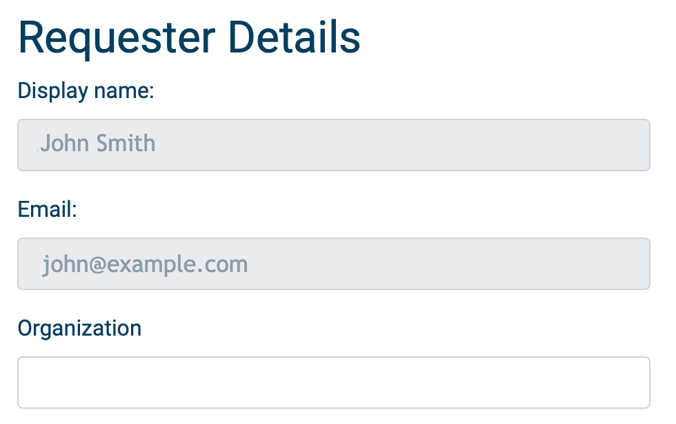
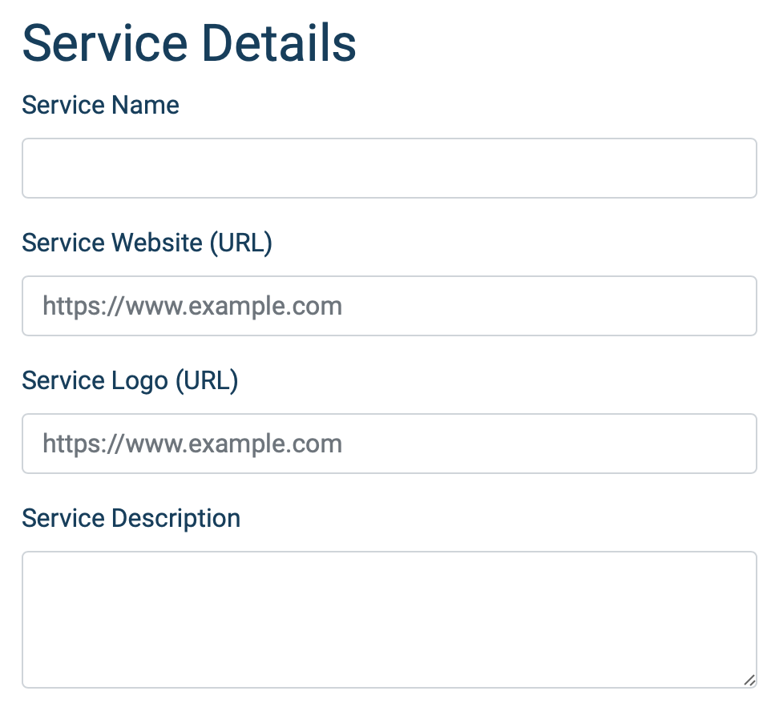

# Integration of Service with Puhuri AAI Proxy

## Overview

This document describes the process of registering a Service with the Puhuri AAI Proxy.

To do so, you will need to fill in the service registration form at: 
- https://webapp.prod.puhuri.eduteams.org/sp_request (for production environment )
- https://webapp.acc.puhuri.eduteams.org/sp_request (for acceptance environment)

Before sending in the application for registration, please make sure that application is complete or else the registration will not be approved.

# Filling in the Service registration form

## Requester Details
- **`Display name`** - Already pre filled from your MyAccessID profile

- **`Email`** - Already pre filled from your MyAccessID profile

- **`Organization`** - If it is not prefilled, please enter the name of your organization. This can be different from the organization / legal entity providing the service

## Organization Information - Legal entity responsible for the service

- **`Organization Name`** - The name of the organization responsible for the service. This information will be visible to the end users.

- **`Organization Website`** - The website of the organization responsible for the service. This information will be visible to the end users.

## Service Details

- **`Service Name`** - The name of the service that is subject of your request for connecting to Puhuri AAI proxy. This information will be visible to the end users.

- **`Service Website (URL)`** - The URL of the website or landing page for the service. This information will be visible to the end users.

- **`Service Logo (URL)`** - A URL with the logo / icon of the service.

- **`Service Description`** - Brief description of the service. This information will be visible to the end users.

## Contact Information

Email addresses for administrative, security and technical contacts or teams responsible for the service. This information will be visible to the end users.

## Service Provider Policies

- **`Privacy Notice (URL)`** - A URL pointing to the privacy notice of the service. A good example of what an Privacy Notice should contain can be found at [REFEDS wiki](https://wiki.refeds.org/display/CODE/Privacy+policy+guidelines+for+Service+Providers). This information will be visible to the end users.

- **`Acceptable Usage Policy / Terms of Use`** - A URL pointing to the Acceptable Usage Policy and/or Terms of Use of the service. Consider using the [WISE Baseline AUP template](https://wise-community.org/wise-baseline-aup/)

- **`GÉANT Data Protection Code of Conduct`** - Click the check box if the service is compliant with the GÉANT Code of Conduct. You can find more information about the [GÉANT Code of Contact at REFEDS wiki](https://wiki.refeds.org/display/CODE/Data+Protection+Code+of+Conduct+Home)

- **`Sirtfi`** - Click the checkbox if the service is compliant with Sirtfi. You can find more information about the [Sirtfi framework at REFEDS website](https://refeds.org/sirtfi)

- **`Research and Scholarship`** - Click the check box if the service is compliant with Research and Scholarship entity category. **Usage of Research and Scholarship entity category is mandatory for all services connected to PUHURI Proxy**. You can find more information about the [Research and Scholarship entity category at REFEDS website](https://refeds.org/category/research-and-scholarship)

- **`Incident Response Policy (URL)`** - A URL pointing to the Incident Response policy applicable to the service. This is an optional field.

## Technical information for registering the Service Provider

**SAML or OIDC** - Choose SAML for registering a SAML Service Provider

- **Registering a SAML Service provider** 

    - **`SP is part of eduGAIN`** - If the Service Provider is already available in eduGAIN through a participating federation click this checkbox

    - **`SAML2 Entity ID`** - This textbox is only visible if you have selected that the SP is available in eduGAIN. Provide the SAML2 entityID for the service. 

    - **`SAML2 Metadata (URL)`** - This textbox is only visible if you have NOT selected that the SP is available in eduGAIN. Provide the URL pointing to the SAML2 metadata of the service.

- **Registering an OIDC Service Provider**

    - **`Flow`** - Choose the OpenID Connect / OAuth2 flow applicable for your service. Options are Authorization Code and Implicit. The use of Authorization Code is strongly recommended.

    - **`Token Endpoint Authentication Method`** - Choose the token endpoint authentication method for your service. Options are client_secret_basic and client_secret_post.

    - **`Offline access`** - If the service requires offline access, check this checkbox. For services connecting to PUHURI proxy will not need this option. 

    - **`OIDC Redirect URLs`** - Enter one or more OIDC redirect URLs for your service

## Form submission

When you click on the "Submit" button, you will see a page confirming your application request. 

You will get the secret displayed after submitting the registration form. Store that in a secure place as you will need it for configuring.

Your application will be reviewed by the eduTEAMS and Puhuri Support team and you will be notified via email.
