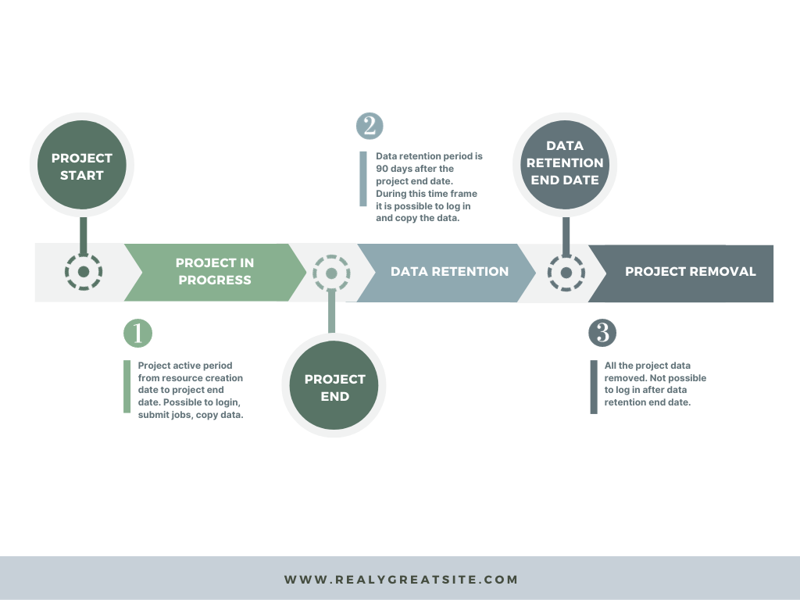

# LUMI Users

## If User’s Home Organization changes

- <b>Informing Changes:</b>

If a user changes their organization, it is their responsibility to notify the Principal Investigator (PI).
If the PI's organization changes, they should inform the Resource Allocation Body (RA), as specified in the service provider's terms of use.

- <b>Evaluation and Approval:</b>

The PI and/or RA will assess whether continued usage is allowed.

- <b>Account Transition:</b>

Users must register a new account due to identity provider changes.
The new user account needs to be added to the project by the PI or co-PI.

- <b>Data Migration:</b>

Before closing the old account, users should migrate files to the home organization.
Data can be copied back when the new account is opened.

- <b>Usage Restrictions:</b>

If LUMI usage is disallowed, the PI or RA should remove the user from the project team.

## LUMI Project Lifecycle

   
