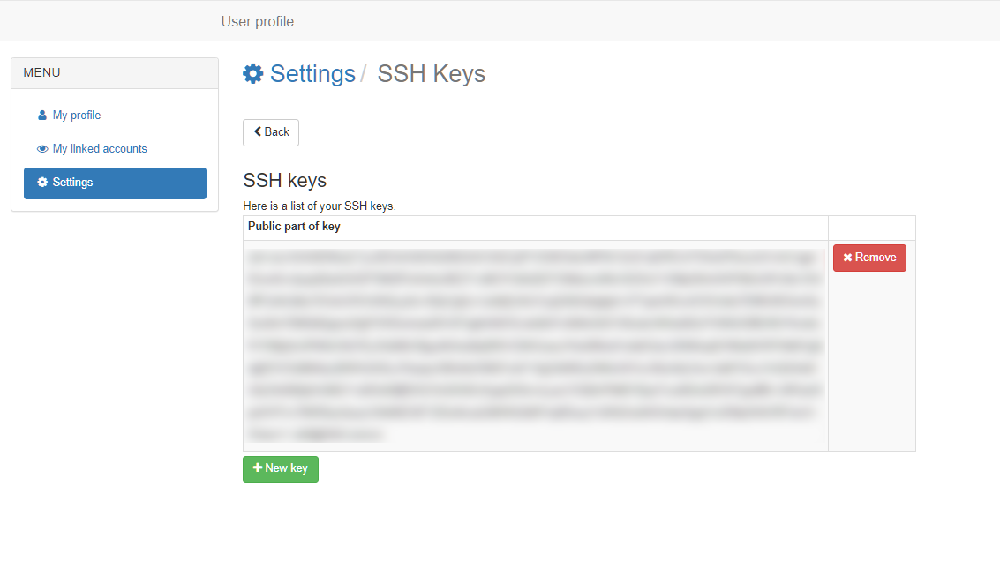

# Adding SSH key to MyAccessID profile

1. Login to the MyAccessID profile [management page](https://mms.myaccessid.org/fed-apps/profile/).
2. Click “Settings” from the left-side menu.
3. Click on “SSH Keys”
   

4. Click on “New Key” and then add the public part of your SSH key and save the key by clicking “Add SSH key”.
   

5. Key propagation to the service provider may take 1-2 hours.

!!! note
    For LUMI supercomputer users: LUMI only accepts SSH keys based on the RSA (4096 bit) or ed25519 algorithms. If possible, we recommend to use ed25519. Please see the details in [LUMI documentation](https://docs.lumi-supercomputer.eu/firststeps/SSH-keys/). 