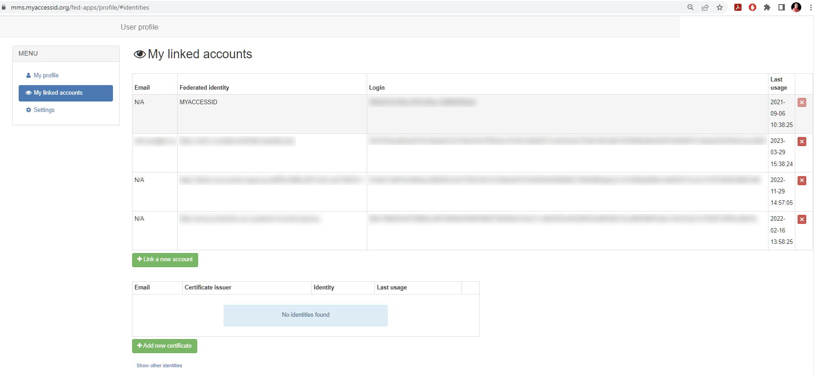

# MyAccessID account linking

MyAccessID allows to merge multiple identities into one MyAccessID identity. By doing this, no matter which IdP is used for authentication, connected services will get always one single identity.

To link identities, please follow these steps:

1. Login to [MyAccessID profile management page](https://mms.myaccessid.org/fed-apps/profile/) 
2. Click on "My Linked Accounts"
   

3. Now you can see the table with your linked accounts. 
   

The first column shows the email connected to specific identity, second column shows the IdP name, third one shows the unique identifier connected to that IdP and the fourth one shows the timestamp of last usage of this IdP. X-mark after that allows to delete the linked identity.

The first row in that table (excl headings) shows that your identity belongs to MyAccessID and next to that you can find the unique identifier connected to your MyAccessID account and this will be shared with the connected service provider if you're using MyAccessID AAI service.
The row after that contains your current home organization (IdP) information.

To add more linked identities, please click on "Link a New Account" and follow the on-screen process as you normally do, when you login with MyAccessID, but this time choose some other Identity Provider. It could be some other academic institution or eIDAS option.

   
   

When everything is correct, then you will see a message on a green background that your identities are successfully linked.
