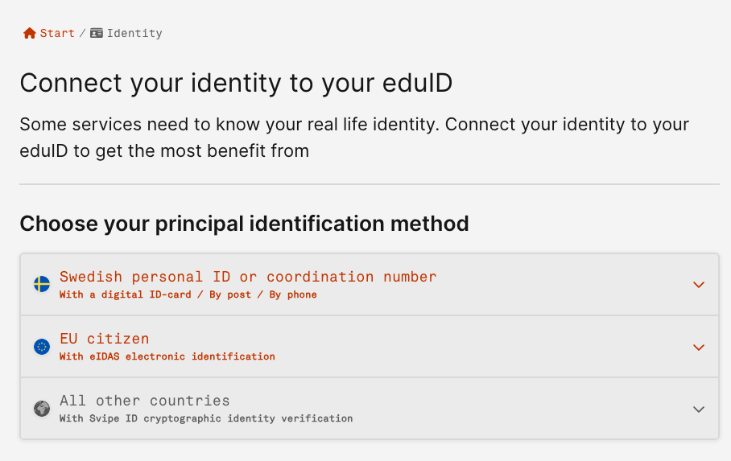

# MyAccessID account registration

Currently, MyAccessID provides 3 different ways to register an account:

1. via academic institution available in eduGAIN
2. via national identity provider (eIDAS)
3. via eduID Sweden

### Create an account using your home academic institution

To use this option, your home organization must be available in eduGAIN.
To check that, type your home organization name into the search field on the MyAccessID login page.

{ width="500" }

If you can find the correct organization, follow the process to authenticate yourself with your home organization credentials. If everything is correct, you will be redirected back to MyAccessID and you are asked to accept the MyAccessID and Service Provider Terms of Use documents and Privacy Policies.

{ width="600" }

If you cannot find your home organization, please proceed with Option 2 below.

### Create an account using a national identity provider (eIDAS)

To use eIDAS as an authentication method, please choose "Login with eIDAS"

{ width="500" }

Then you're redirected to the eIDAS login page, where you can find available countries.

{ width="600" }

By selecting a particular country (clicking a flag), you will be forwarded to the national login page. 
The authentication methods behind the flags are different in each country. It may be that your country is not listed there.

If everything is correct, you will be redirected back to MyAccessID and you are asked to accept the MyAccessID and Service Provider Terms of Use documents and Privacy Policies.

{ width="600" }

If you did not find your flag, please proceed to Option 3 below.

### Create an account using eduID Sweden

For users who do not have  an academic identity or supported eIDAS digital identity, it is possible to register a new digital identity with eduID Sweden by selecting this option on the MyAccessID login page.

{ width="500" }

Then you're forwarded to the eduID Sweden login page where you can log in with an existing account or create a new one.

{ width="600" }

When selecting "Register", please use your email and follow the instructions.

!!! note
    Please remember to use your organizational email, not the private one.

{ width="600" }

You're asked to accept the eduID rules and prove you're a human.

{ width="600" }
{ width="500" }

After adding your email address to register, you will get a verification email with a code to verify your email address. 
You're asked to enter your first name, last name and other relevant information. Required information may change over time.

!!! note
    There is NO need to put an ID number, mobile phone or anything else in the “identity” or “advanced settings” tabs.

{ width="600" }

After finishing the registration, if everything is correct, you will be redirected back to MyAccessID to accept Terms of Use documents and Privacy Policies.

{ width="600" }

### Raising the level of assurance with the eduID account
 
As of today, not raising the level of assurance still allows you to access the resource. If your Level of Assurance attribute is not good enough, you will see the warning during the authentication process, but clicking "Proceed to the service" still allows access.

In the next step, by reviewing your information, click the "Verify your identity" tab to verify your account.

{ width="600" }
{ width="600" }

To connect your identity to your eduID, there are currently 2 options out of 3 available to increase the assurance level of authentication.

{ width="600" }

1. Swedish Personal ID number - if you are a Swedish citizen you can utilize this option by your digital ID card or post or your phone number.
2. EU citizen - if you are a citizen of one of the eIDAS countries you can use your electronic identification. Please note that you can use eIDAS identification to connect to MyAccessID directly.

!!! warning
    The third option for "All other countries" is currently unavailable. EduID is working on finding a solution for identity vetting for the rest of the countries' citizens.

