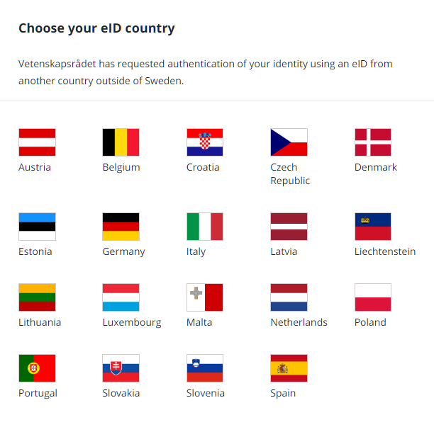
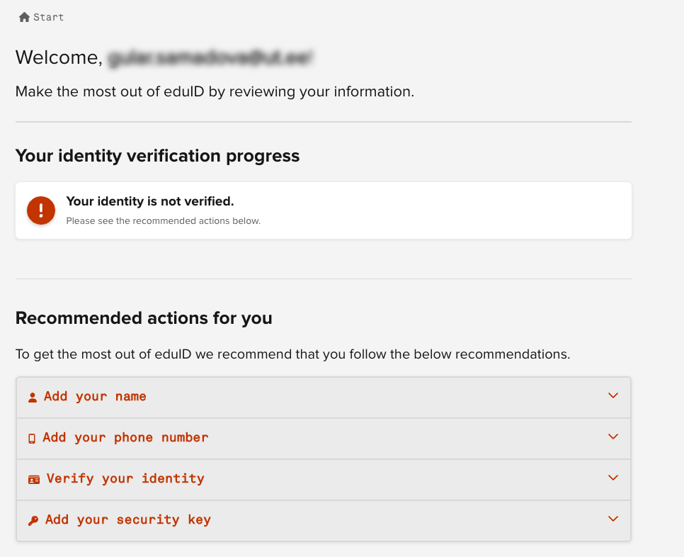

# MyAccessID account registration

Currently, MyAccessID provides 3 different ways to register account:

1. via academic institution available in eduGAIN
2. via national identity provider (eIDAS)
3. via eduID Sweden

### Create account using your home academic institution

In order to use this option, your home organization must be available in eduGAIN.
To check that, type your home organization name to search field on MyAccessID login page.

{ width="500" }

If you are able to find the correct organization, follow the process to authenticate yourself with your home organization credentials. If everything is correct, you will be redirected back to MyAccessID and you are asked to accept the MyAccessID and Service Provider Terms of Use documents and Privacy Policies.

{ width="600" }

If you're not able to find your home organization, please proceed with the Option 2 below.

### Create account using national identity provider (eIDAS)

To use eIDAS as authentication method, please choose "Login with eIDAS"

{ width="500" }

Then you're redirected to eIDAS login page, where you can find available countries.

{ width="600" }

By selecting particular country (clicking a flag) you will be forward you to the national login page. 
The authentication methods behind the flags are different in each country. It may be that you do not have a possibility to use your country's options.

If everything is correct, you will be redirected back to MyAccessID and you are asked to accept the MyAccessID and Service Provider Terms of Use documents and Privacy Policies.

{ width="600" }

In case you did not find your flag, please proceed to Option 3 below.

### Create account using eduID Sweden

For users who do not have  academic identity or supported eIDAS digital identity, it is possible to register a new digital identity with eduID Sweden by selecting this option on MyAccessID login page.

{ width="500" }

Then you're forwarded to eduID Sweden login page where you can log in with already existing account or create a new one.

{ width="600" }

When selecting "Register", please use your email and follow the instructions.

!!! note
    Please remember to use your organizational email, not the private one.

{ width="600" }

You're asked to accept the eduID rules and prove that you're an human.

{ width="600" }
{ width="500" }

After adding your email address to register, you will get a verification email with a code to verify your email address. 
You're asked to enter your first name, last name and other relevant information. Required information may change over time.

!!! note
    There is NO need to put an ID number, mobile phone or anything else in the “identity” or “advanced settings” tabs.

{ width="600" }

### Raising the level of assurance with eduID account

In the next step, by reviewing your information, click to the "Verify your identity" tab so you can verify your account.

{ width="600" }
{ width="600" }

To connect your identity to your eduID there are 3 options, to increase the authentication level.

{ width="600" }

Click on the third option "All other countries" to use Svipe ID cryptogtaphic identity verification method.

{ width="600" } 

After finishing the registration, if everything is correct, you will be redirected back to MyAccessID to accept Terms of Use documents and Privacy Policies.

{ width="600" }

