# MyAccessID account registration

Currently, MyAccessID provides 3 different ways to register an account:

1. via academic institution available in eduGAIN
2. via national identity provider (eIDAS)
3. via eduID Sweden

### Create an account using your home academic institution

To use this option, your home organization must be available in eduGAIN.
To check that, type your home organization name into the search field on the MyAccessID login page.

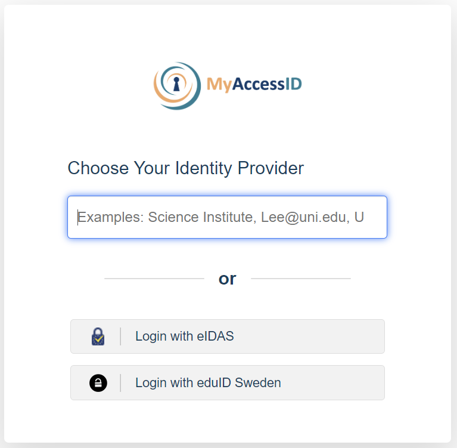{ width="500" }

If you can find the correct organization, follow the process to authenticate yourself with your home organization credentials. If everything is correct, you will be redirected back to MyAccessID and you are asked to accept the MyAccessID and Service Provider Terms of Use documents and Privacy Policies.

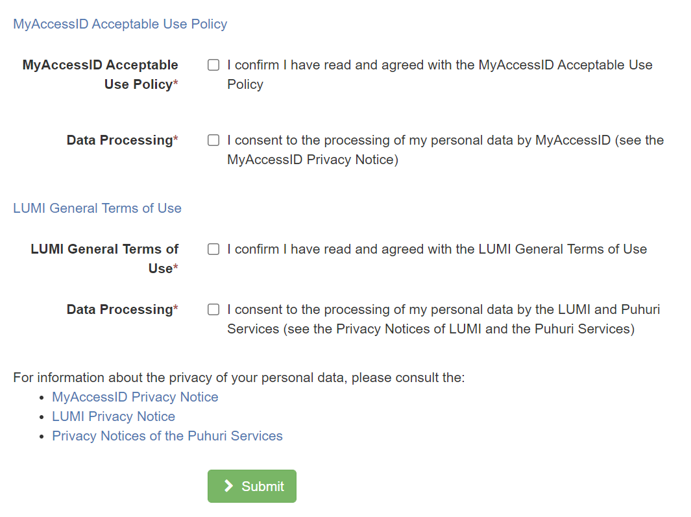{ width="600" }

If you cannot find your home organization, please proceed with Option 2 below.

### Create an account using a national identity provider (eIDAS)

To use eIDAS as an authentication method, please choose "Login with eIDAS"

{ width="500" }

Then you're redirected to the eIDAS login page, where you can find available countries.

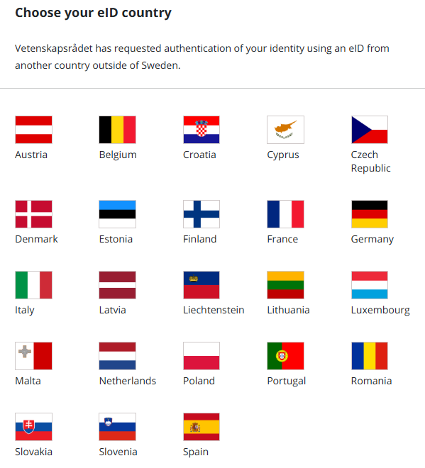

By selecting a particular country (clicking a flag), you will be forwarded to the national login page. 
The authentication methods behind the flags are different in each country. It may be that your country is not listed there.

If everything is correct, you will be redirected back to MyAccessID and you are asked to accept the MyAccessID and Service Provider Terms of Use documents and Privacy Policies.

{ width="600" }

If you did not find your flag, please proceed to Option 3 below.

### Create an account using eduID Sweden

For users who do not have  an academic identity or supported eIDAS digital identity, it is possible to register a new digital identity with eduID Sweden by selecting this option on the MyAccessID login page. 

!!! note

    The latest step-by-step guide for logging in, registering, and verifying your account is available on the [eduID website :material-open-in-new:](https://eduid.se/help){:target="_blank"}

Click on "Add another institution" to see this option. 

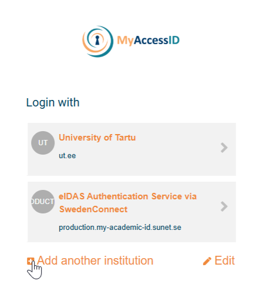
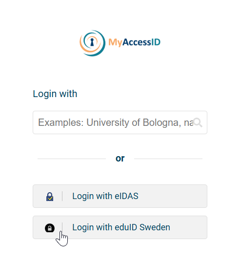

Then you're forwarded to the eduID Sweden login page where you can log in with an existing account or create a new one.

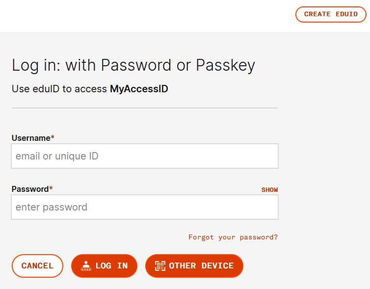{ width="600" }

When selecting "CREATE EDUID", please use your email and follow the instructions.

!!! note
    Please remember to use your organizational email, not the private one.

After finishing the registration, you will be able to log in.

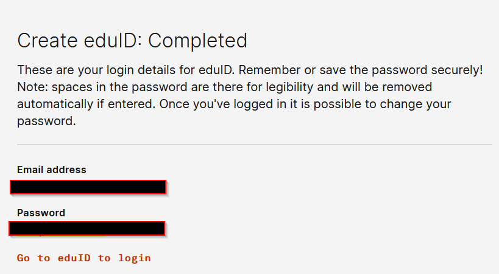{ width="600" }

#### Raising the level of assurance with the eduID account

After logging in, to raise the level of assurance, click the "Verify your identity" tab to verify your account by reviewing your information.

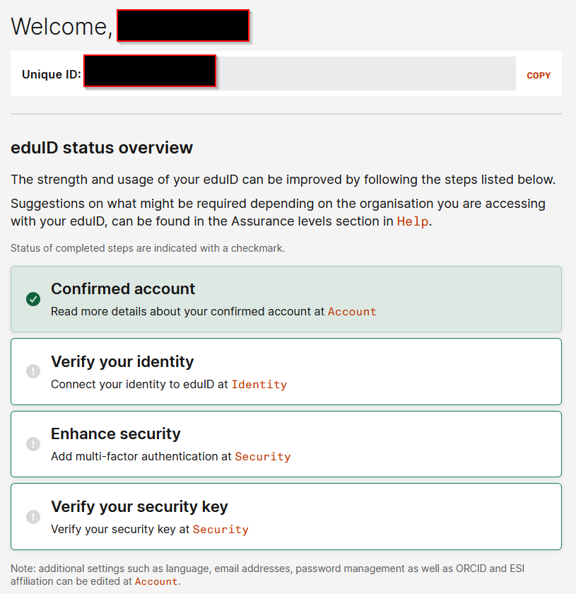{ width="600" }

To connect your identity to your eduID, there are currently 3 options available to increase the assurance level of authentication.

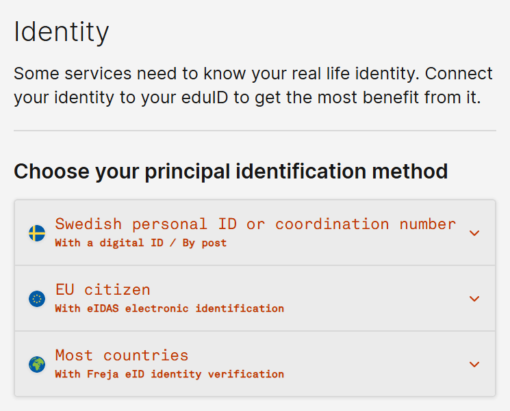{ width="600" }

1. Swedish Personal ID or coordination number - if you are a Swedish citizen, you can utilize this option by your digital ID card or post or your phone.
2. EU citizen - if you are a citizen of one of the eIDAS countries, you can use your electronic identification ([see above](#create-an-account-using-a-national-identity-provider-eidas)). 
3. Most countries - if options 1 and 2 are not suitable, you can create an account and verify your identity using Freja eID.

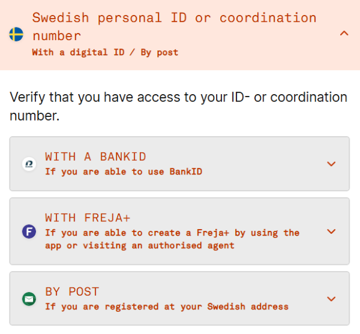
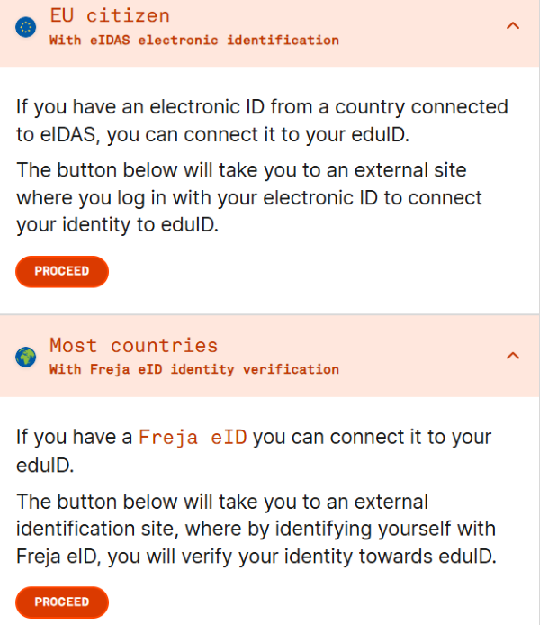

