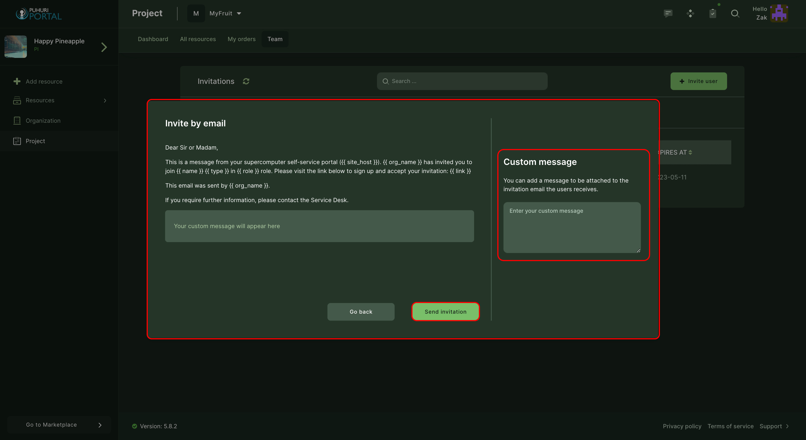

# Project membership management

Project team contains users with different roles:

- Co-Principal Investigator (Co-PI) - An individual recognized by the prime institution and the principal investigator (PI) as someone who shares scientific and administrative leadership responsibilities for a project with the PI.
- Member - Users who work on one or more phases of the project and involved in doing assigned tasks.
- Guest - Users who are only able to see project related data, not able to modify it.

Please see [this page](https://puhuri.neic.no/user_guides/user_roles/) for User Rights based on Roles in the Organization.

## Adding project members

### New user has Puhuri account:
 
1. Open your project in Puhuri Portal.
2. Select "Team" from top menu and click on "Users".
3. By clicking "Add member" open "Add project member" window. 
 
4. Select correct user, set the role and expiration date if necessary.

5. Finally, click on "Add".

6. User now will get invitation email with the acceptance link.

!!! note
    Invitation is valid for 3 weeks!

### New user don't have Puhuri account:

1. Open project in Puhuri Portal.
2. Select "Team" from top menu and click on "Invitations".

   
   
   
3. By clicking "Invite user" open "Invite by email" window.

   

4. Insert user's email and set the role for the new user and continue.

5. Fill in your custom message on the right side of the window and send the invitation.

   
   
6. User now will get invitation email with the acceptance link.

!!! note
    Invitation is valid for 3 weeks!
    
    
!!! abstract "Feedback"
    We welcome feedback from our users - it helps us to continually improve. Please send an email with your suggestions to [support@puhuri.io](mailto:support@puhuri.io).

