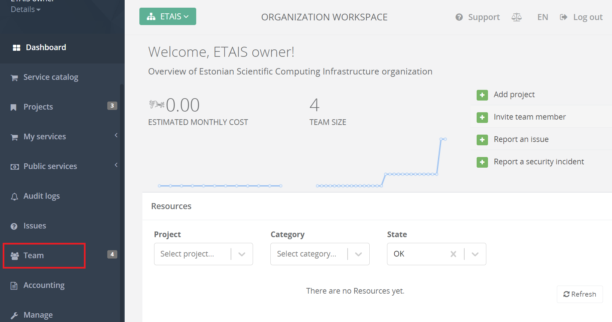

# Project membership management

### Management of project team

Project team contains users with different roles:

- Principal Investigator (PI) - The lead researcher and primary contact for the project, also organization owner
- Co-Principal Investigator (Co-PI) - An individual recognized by the prime institution and the principal investigator (PI) as someone who shares scientific and administrative leadership responsibilities for a project with the PI.
- Member - Users who work on one or more phases of the project and involved in doing assigned tasks.
- Guest - Users who are only able to see project related data, not able to modify it.

Please see [this page](https://puhuri.neic.no/user_guides/user_roles/) for User Rights based on Roles in the Organization.

## Adding PI to organization.

!!! note
    This is only allowed to national resource allocator representatives!

1. Login to Puhuri Portal with MyAccessID. 
   { width="400" }

2. Select correct organization from "Select workspace".
3. Select "Team" from left menu.
   

4a. If user already has Puhuri account, then click "Add PI" and select user from the drop-down list.
    
    { width="400" }

4b. If user do not have Puhuri account, then "Invitations" and "Invite user".
    
    { width="400" }

## Adding project members

### If user already has Puhuri account connected with the organization, then:

1. Login to Puhuri Portal with MyAccessID.
   { width="400" }

2. Open project in Puhuri Portal.
3. Select "Team" from left menu and click on "Add member".
   
   

4. Select correct user, set the role and expiration date if necessary.
   { width="400" }

5. Finally, click on "Add".
6. User now will get invitation email with the acceptance link.

!!! note
    Invitation is valid for 1 week!

### If user does not have Puhuri account, then:

1. Login to Puhuri Portal with MyAccessID.
   { width="400" }

2. Select your organization.
   
   { width="400" }

3. Click on "Invite team member". 
   

4. Insert user's email and set the role and project (in case of inviting Co-PI, Member or Guest) for the new user.
   { width="400" }

5. Click "Invite user".
6. User now will get invitation email with the acceptance link.

!!! note
    Invitation is valid for 1 week!
    

!!! abstract "Feedback"
    We welcome feedback from our users - it helps us to continually improve. Please send an email with your suggestions to [support@puhuri.io](mailto:support@puhuri.io).
