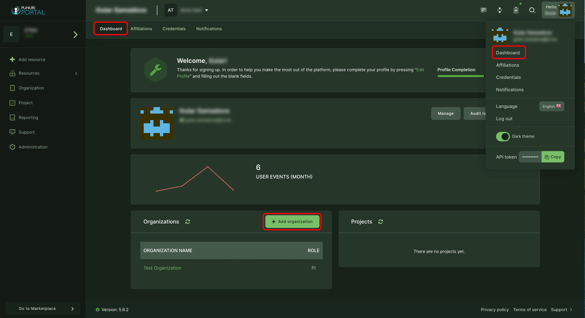
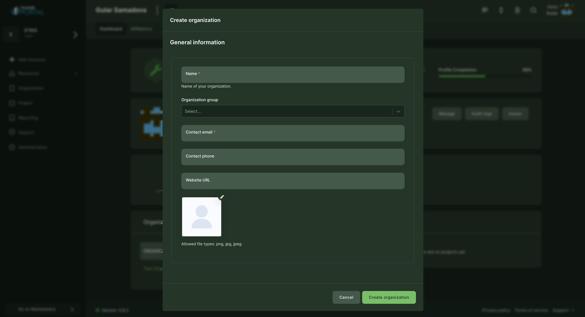
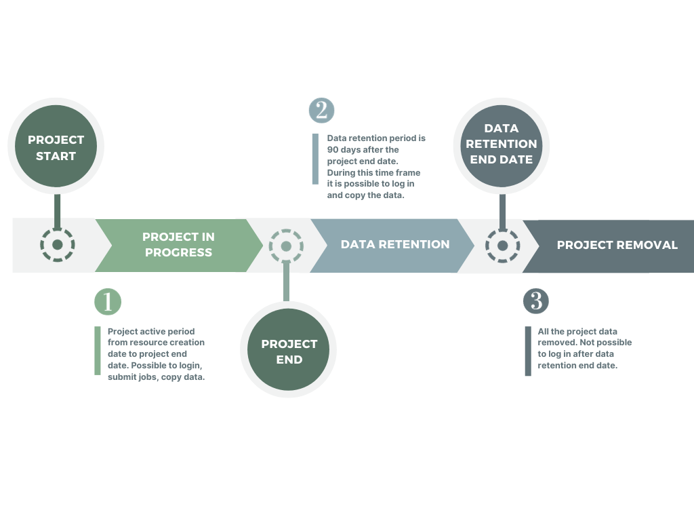
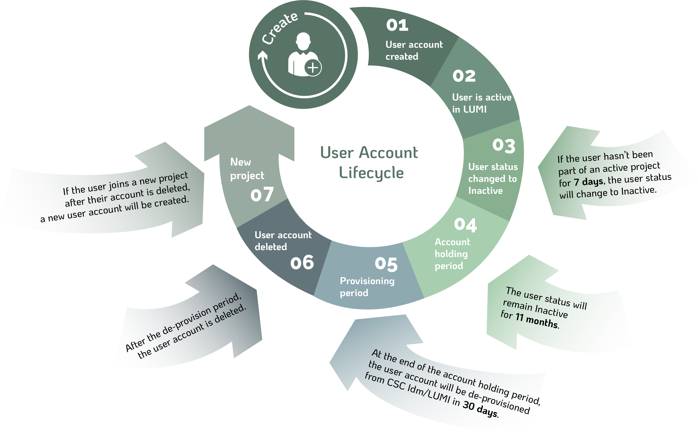

# Organization and project management

## User guide for adding organizations

!!! note
    Organization creation is only allowed for national resource allocator representatives!

Organization in Puhuri Portal context means whatever grouping national resource allocator would like to have.
This can mean for example research group, institution, department or working group. Organization has an owner
who is project principal investigator (PI). National resource allocator can assign owners to organizations.

## Create a new organization

1. Click on "Dashboard" and then “Add organization” in the organization selection window.  
  
2. Fill the form and click "Create organization":
    - Name - Name of the organization
    - Organization group - Resource Allocator that the organization belongs
    - Contact email - email of the person, who is responsible for the allocations in that organization
    - Contact phone - contact person’s phone (optional)
    - Website URL - url of the organization (optional)
    - Logo - logo of the organization (optional)  

## Creation of projects

Project creation is allowed for Principal Investigators (PIs) and Resource Allocators in their organizations.

Prerequisites for creating projects:
    - User must have a Puhuri account (logged in to Puhuri Portal using MyAccessID)
    - Allocator must set PI role to the user in a certain organization

1. Select your home organization.
2. Click on "Add project".
3. Fill in the necessary fields (fields marked with * are mandatory).
    - Project name - The original title of the project.
    - Project description - A brief description about the project.
    - OECD FoS code - OECD science field code ([more info](https://joinup.ec.europa.eu/collection/eu-semantic-interoperability-catalogue/solution/field-science-and-technology-classification/about))
    - Please indicate whether the project is intended for industrial applications.
    - End date - this is the end date for using the computational resources.
    - Project image - Profile picture for the project (optional).

<video controls width="100%" autoplay="true" muted loop >
  <source src="../../../assets/videos/how_to_add_project_1.mp4" type="video/mp4">
</video>

## Requesting an allocation

To get an allocation via Puhuri Portal, project participants must first request it.
Request can be initiated by any user, however it must be approved:

 - by PI before being sent to Resource Allocator.
 - by Resource Allocator before being sent to Puhuri Core for processing by the service.

Below is an example of requesting an allocation from LUMI supercomputer:

1. Select "Add resource" or "Go to Marketplace" from the sidebar menu and select offering that matches your plans.
   For LUMI, offerings correspond to access types of EuroHPC:
    - Extreme Scale Access
    - Regular Access
    - Benchmark Access
    - Development Access
    - Fast Track Access for Academia
    - Fast Track Access for Industry  
2. Write the name for the resource allocation (NOTE: This name will be visible in accounting data.).
3. Select correct plan (LUMI common) and write needed allocation quota (CPU, GPU and Storage).
4. Write short description (optional).
5. Click on the "Add to cart".
6. Check once more and click on "Request an approval" if you are not a PI in a project or "Request" if you are a PI.

<video controls width="100%" autoplay="true" muted loop >
  <source src="../../../assets/videos/how_to_add_resource.mp4" type="video/mp4">
</video>

After this, the Resource allocator will get a request for the resource and be able to [approve or reject](project_approval_shared.md) it.

## Applicable to LUMI only

## If User’s Home Organization/Employer changes

- <b>Informing Changes:</b>

If a user changes their organization, it is their responsibility to notify the Principal Investigator (PI).
If the PI's organization changes, they should inform the Resource Allocation Body (RA), as specified in the service provider's terms of use.

- <b>Evaluation and Approval:</b>

The PI and/or RA will assess whether continued usage is allowed. If the continued usage is allowed, then:

- <b>Account Transition:</b>

Users must register a new account due to identity provider changes.
The new user account needs to be added to the project by the RA, PI, or co-PI.

- <b>Data Migration:</b>

Before closing the old account, users should migrate files to the home organization.
Data can be copied back when the new account is opened.

- <b>Usage Restrictions:</b>

If LUMI usage is disallowed, the PI or RA should remove the user from the project team. Please note: once the user account is disconnected from all projects, the user will lose access to LUMI.

## LUMI Project Lifecycle

   

## LUMI User Account Lifecycle

!!! abstract "Feedback" 
    We welcome feedback from our users - it helps us to continually improve. Please send an email with your suggestions to [support@puhuri.io](mailto:support@puhuri.io).

