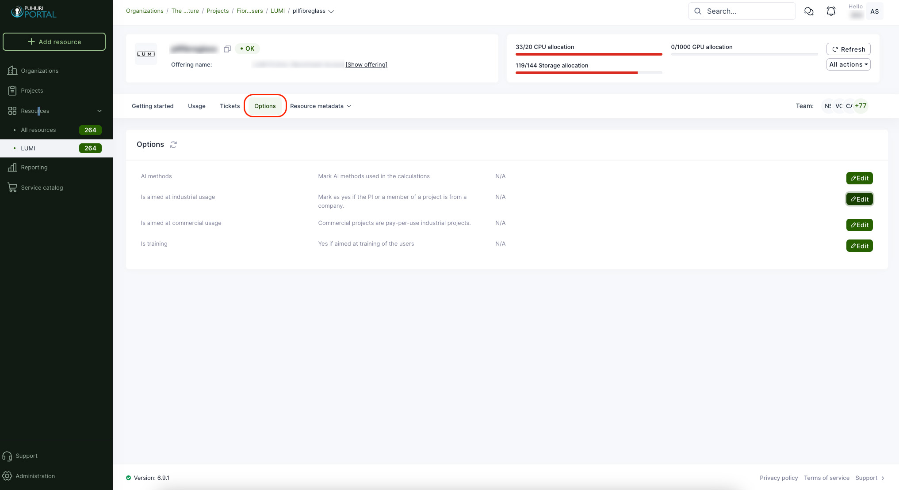

# Organization and project management

## User guide for adding organizations

!!! note
    Organization creation is only allowed for national resource allocator representatives!

Organization in the Puhuri Portal context means whatever grouping the national resource allocator would like to have.
This can mean, for example, a research group, institution, department, or working group. The organization has an owner
who is the project principal investigator (PI). National resource allocators can assign owners to organizations.

## Create a new organization

1. Login to the portal and click "Organizations" in the left-side menu and then “Add organization” on the right side.
2. A popup opens, and enters the name of the new organization and also the contact email.
3. Click "Create organization".
4. Now, an organization management page opens, where you can add additional information about the organization.
5. Management view is divided into sections, and after editing a section, click "Save changes".

<video controls width="100%" autoplay="true" muted loop >
  <source src="../../../assets/videos/create_organization.mp4" type="video/mp4">
</video>

## Creation of projects

Project creation is allowed for Principal Investigators (PIs) and Resource Allocators in their organizations.

Prerequisites for creating projects:
    - User must have a Puhuri account (logged in to Puhuri Portal using MyAccessID)
    - Allocator must set PI role to the user in a certain organization

1. Select your home organization dashboard.
2. Click on "Add project" on the right side.
3. Fill in the necessary fields (fields marked with * are mandatory).
    - Project name - The original title of the project.
    - Project description - A brief description about the project.
    - OECD FoS code - OECD science field code ([more info](https://joinup.ec.europa.eu/collection/eu-semantic-interoperability-catalogue/solution/field-science-and-technology-classification/about))
4. Click the button "Create".
    - Once the project is created, you can add the project start and end date.
5. Choose on Project dashboard "Edit" tab and update the respective fields.
    - Start date - this is the start date when the computational resources will become available. If not chosen, the project will start from the moment the resource is activated. 
    - End date - this is the end date for using the computational resources.
    - Project image - Profile picture for the project (optional).

<video controls width="100%" autoplay="true" muted loop >
  <source src="../../../assets/videos/create_project.mp4" type="video/mp4">
</video>

## Requesting an allocation

To get an allocation via Puhuri Portal, project participants must first request it.
Request can be initiated by any user, however it must be approved:

 - by PI before being sent to Resource Allocator.
 - by Resource Allocator before being sent to Puhuri Core for processing by the service.

Below is an example of requesting an allocation from LUMI supercomputer:

1. Open your project dashboard and select "Resources" from the top menu. Click on "Add resources" on the right side.
2. This will open a service catalogue where you can select the correct offering that matches your plans.
   For LUMI, offerings correspond to access types of EuroHPC:
    - Extreme Scale Access
    - Regular Access
    - Benchmark Access
    - Development Access
    - Fast Track Access for Academia
    - Fast Track Access for Industry  
3. When you have found the correct offering, click "Deploy". 
4. This will open the offering configuration page, where you can set the allocation quota limits (CPU, GPU and Storage), add resource name, set whether the project is AI-related, for testing, etc.
5. When all set, click "Create" on the right side.
6. A confirmation popup opens, click "Yes".
7. After this, the Resource allocator will get a request for the resource and be able to [approve or reject](project_approval_shared.md) it.
8. Now, the resource dashboard opens, showing the approval status, resource usage, and limits information.

<video controls width="100%" autoplay="true" muted loop >
  <source src="../../../assets/videos/how_to_add_resource.mp4" type="video/mp4">
</video>

## Applicable to LUMI only

The following attributes are mandatory to flag for LUMI projects and resources:

- <b>Project End date:</b>

To set the end date for the existing project, please open your project in the portal and select on the project dashboard the tab "Edit" to update the respective fields.

- <b>Resource use-case type if applicable:</b>

    * AI-related use (multiple can be selected)
    * Industrial project
    * Commercial project
    * Training project
      
To set those flags for existing projects, please open your project and resource in the portal and select "Options" from the top menu. Then, you will see four different flags. You can toggle them on and off by clicking "Edit" on the right. For the AI, it is necessary to set the exact method(s).

## If User’s Home Organization/Employer changes

- <b>Informing Changes:</b>

If a user changes their organization, it is their responsibility to notify the Principal Investigator (PI).
If the PI's organization changes, they should inform the Resource Allocation Body (RA), as specified in the service provider's terms of use.

- <b>Evaluation and Approval:</b>

The PI and/or RA will assess whether continued usage is allowed. If the continued usage is allowed, then:

- <b>Account Transition:</b>

Users must register for a new account due to changes in their identity provider.
The new user account must be added to the project by the RA, PI, or co-PI.

- <b>Data Migration:</b>

Before closing the old account, users should migrate files to the home organization.
Data can be copied back when the new account is opened.

- <b>Usage Restrictions:</b>

If LUMI usage is disallowed, the PI or RA should remove the user from the project team. Please note: once the user account is disconnected from all projects, the user will lose access to LUMI.

## LUMI Project Lifecycle

   

## LUMI User Account Lifecycle

!!! abstract "Feedback" 
    We welcome feedback from our users - it helps us to continually improve. Please send an email with your suggestions to [support@puhuri.io](mailto:support@puhuri.io).

