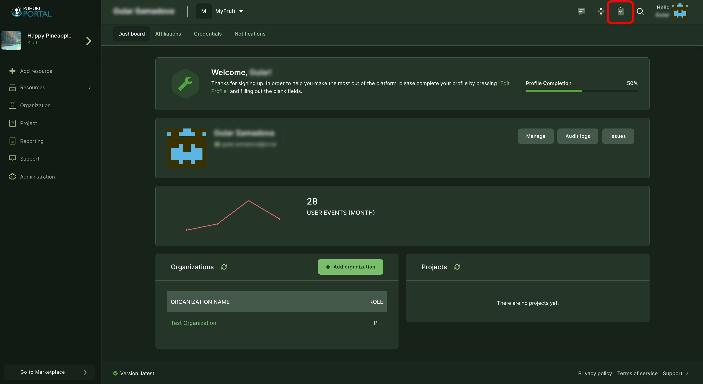
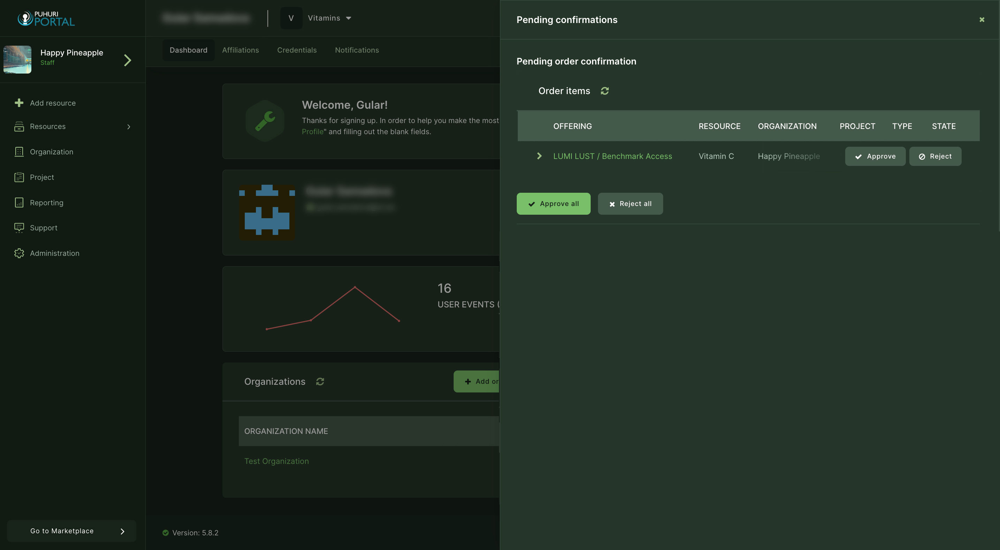

# Projects and allocations approval process

!!! note
    Following processes are only allowed to national resource allocator representatives!

## Approving project and allocation creation, update requests

1. Click on  "Pending confirmations" button on the top-right side of your Dashboard. In this window, the lists of "Pending order confirmation" and "Pending provider confirmation", as well as "Project update requests" can be found.  
  
2. Select the request to click “Approve” or "Reject". Also by clicking "Approve all" or "Reject all", the action can be done for all the requests at once.  

!!! abstract "Feedback" 
    We welcome feedback from our users - it helps us to continually improve. Please send an email with your suggestions to [support@puhuri.io](mailto:support@puhuri.io).
