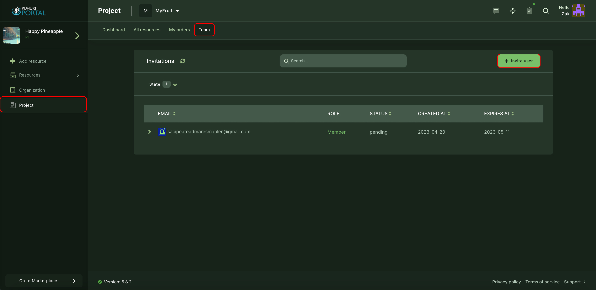
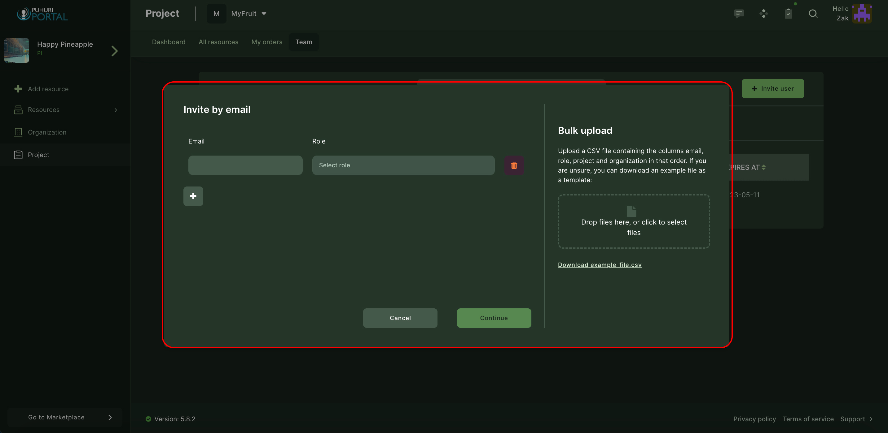
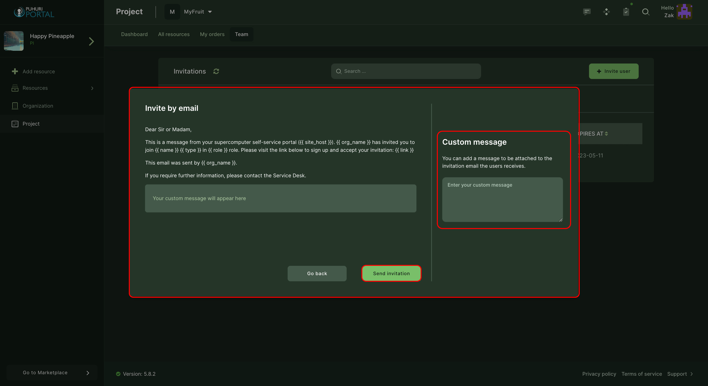

# Project membership management

Project team contains users with different roles:

- Principal Investigator (PI)  - An individual recognized by the prime institution who is responsible for the scientific and administrative leadership of the project.
- Co-Principal Investigator (co-PI) is a collaborator who shares leadership and responsibility for a research project with the primary Principal Investigator (PI).
- Member is a user who works on one or more phases of the project and is involved in executing assigned tasks.
  
Please see [this page](https://puhuri.neic.no/user_guides/user_roles/) for User Rights based on Roles in the Organization.

## Adding project members

1. Open project in Puhuri Portal.  
2. Select "Team" from the top menu and click on "Invitations". <be>

      

3. Clicking "Invite user" opens the "Invite by email" window. <be>

      

4. Insert the user's email, set the role for the new user and continue. <be>

5. Fill in your custom message on the right side of the window and send the invitation. <be>

      

6. The user will receive an invitation email with the acceptance link.

!!! note
    The invitation is valid for 3 weeks!

!!! abstract "Feedback"
    We welcome feedback from our users - it helps us to improve continually. Please email your suggestions to [support@puhuri.io](mailto:support@puhuri.io).
