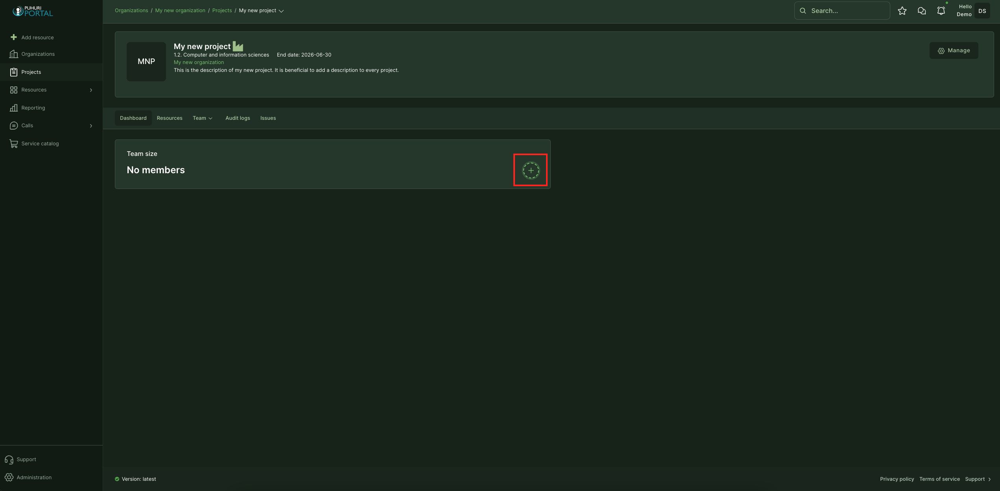
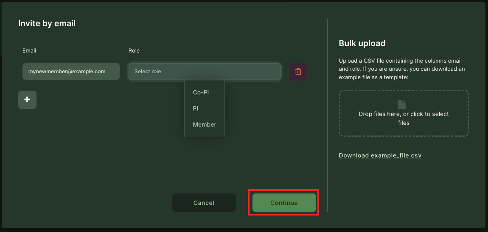
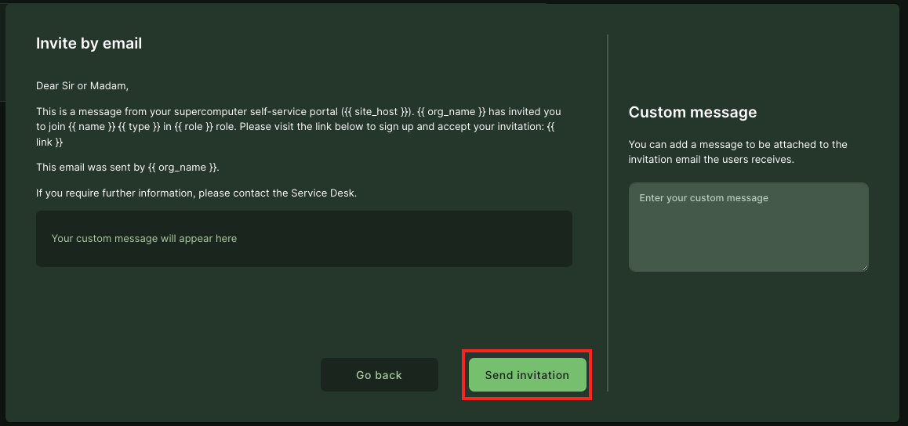
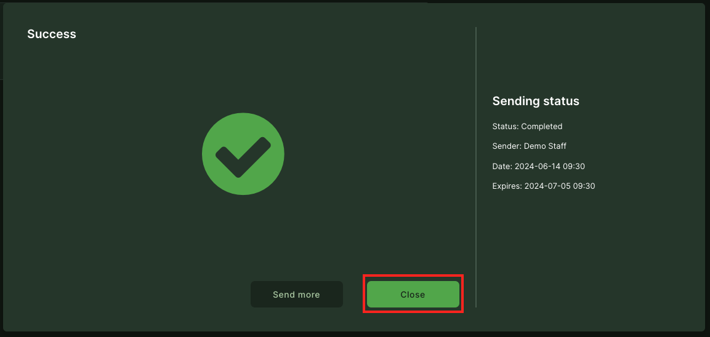

# Project membership management

Project team contains users with different roles:

- Principal Investigator (PI)  - An individual recognized by the prime institution, is responsible for the scientific and administrative leadership of the project (request additional resources, manage membership, view usage information, etc). Can use the resources connected to the project. 
- Co-Principal Investigator (co-PI) is a collaborator who shares leadership and responsibility for a research project with the primary Principal Investigator (PI). Can use the resources connected to the project.
- Member is a user who works on one or more project phases and executes assigned tasks. Read-only role in the portal with the ability to see the resource usage information. Can use the resources connected to the project.
  
Please see [this page](https://puhuri.neic.no/user_guides/user_roles/) for User Rights based on Roles in the Organization.

## Adding project members

1. Open your project dashboard in the Puhuri Portal and click the "+" sign in the team box. Another option is to select "Team" from the project dashboard top menu and then "Invitations".  
2. An invitation popup opens, where you can enter the new user email and set the role in the project. Click "Continue".  
3. Fill in your custom message on the right side of the window (if needed) and send the invitation.  
4. Now, you can close the window or create a new invitation.   

!!! note
    The invitation is valid for 3 weeks!

!!! abstract "Feedback"
    We welcome feedback from our users - it helps us to improve continually. Please email your suggestions to [support@puhuri.io](mailto:support@puhuri.io).
