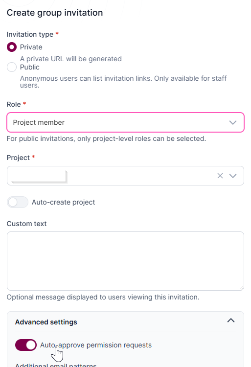

# Project membership management

Project team contains users with different roles:

- Principal Investigator (PI)  - An individual recognized by the prime institution, is responsible for the scientific and administrative leadership of the project (request additional resources, manage membership, view usage information, etc). Can use the resources connected to the project. 
- Co-Principal Investigator (co-PI) is a collaborator who shares leadership and responsibility for a research project with the primary Principal Investigator (PI). Can use the resources connected to the project.
- Member is a user who works on one or more project phases and executes assigned tasks. Read-only role in the portal with the ability to see the resource usage information. Can use the resources connected to the project.
  
Please see [this page](https://puhuri.neic.no/user_guides/user_roles/) for User Rights based on Roles in the Organization.

 **Important:** The project will not sync properly with LUMI if there is no Principal Investigator (PI) assigned.  
> If no team member has the PI role, the project information in LUMI will remain incomplete.  

## Adding project members

You can add project members in two places: the project dashboard or the organization dashboard.

### Using the project dashboard

1. Open your project dashboard in the Puhuri Portal and go to the Team tab. Click "+ Add" to view the two available options: inviting a user by email or adding an existing user by username (some restrictions may apply).
2. In the invitation dialog, enter the user’s email or username and assign a project role. Click Continue.
3. (Optional) Add a custom message, then send the invitation.
4. To view sent invitations, open the Invitations tab.

<video controls width="100%" autoplay="true" muted loop >
  <source src="../../../assets/videos/send_invitation.mp4" type="video/mp4">
</video>

### Using the organization dashboard

1. Open your organization dashboard in the Puhuri Portal and find the "Team" tab. Click on the "+ Add" button to view the three options for inviting project members: "Invite by mail", "Member", and "Group invitation".
2. The first two options are the same as in the project dashboard. "Group invitation" is available only on the organization dashboard.
3. In the group invitation dialog, you can create a private link to share with multiple users. Depending on the assigned role, additional options are available, such as automatically approving requests. 

!!! note
    The invitation is valid for 3 weeks!

!!! abstract "Feedback"
    We welcome feedback from our users - it helps us to improve continually. Please email your suggestions to [support@puhuri.io](mailto:support@puhuri.io).
