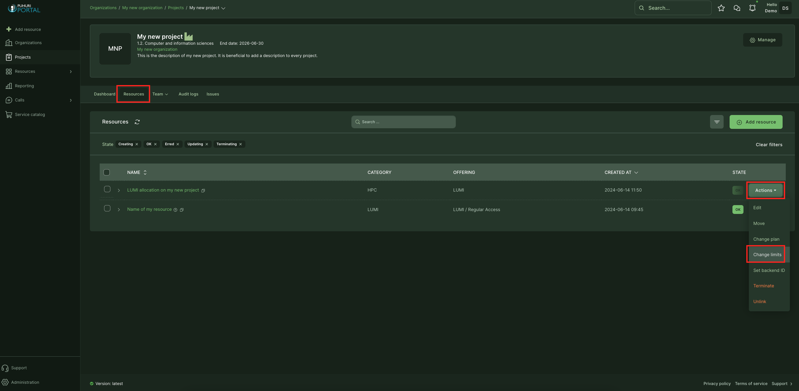
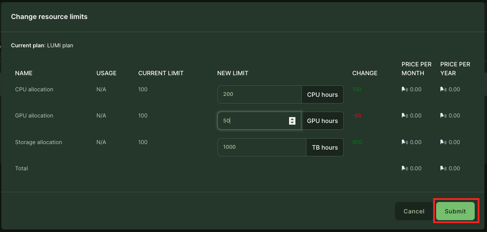
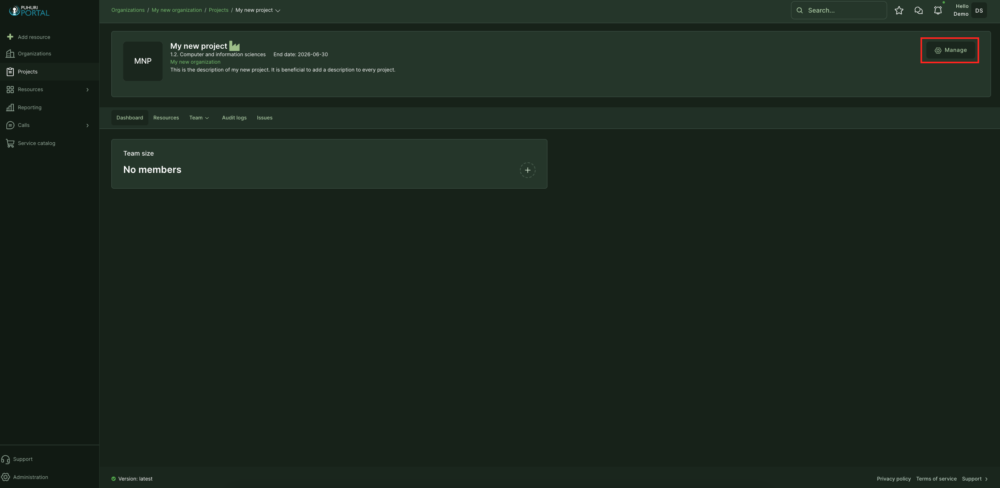
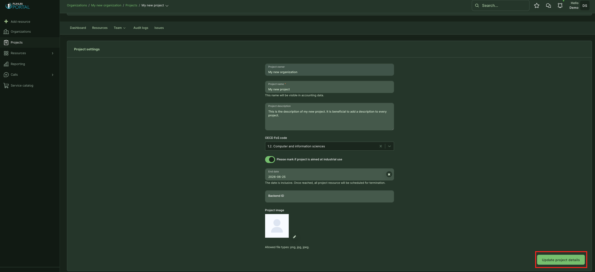

# Projects and allocations management

## Allocation update process

!!! note
    Only (national) resource allocation representatives can approve allocation update requests. 

1. Navigate to the project dashboard and select "Resources" from the top menu.
2. Select the correct allocation by hoovering on that until the "Action" button appears on the right, click on that and select "Change limits".  
3. Set new limits and click "Submit".  
4. Now, the national resource allocator has to [approve the changes.](https://puhuri.neic.no/user_guides/project_approval/)

<video controls width="100%" autoplay="true" muted loop >
  <source src="../../../assets/videos/how_to_update_resource_limit.mp4" type="video/mp4">
</video>

## Project end date update process

!!! note
    Only (national) resource allocation representatives can approve project end-date update requests. 

1. Navigate to the project dashboard and click "Manage" on the right.  
2. Make needed changes and click "Update project details".  
3. Now, the national resource allocator has to [approve the changes.](https://puhuri.neic.no/user_guides/project_approval/)

<video controls width="100%" autoplay="true" muted loop >
  <source src="../../../assets/videos/how_to_update_project_end_date.mp4" type="video/mp4">
</video>

!!! abstract "Feedback"   
    We welcome feedback from our users - it helps us to improve continually. Please email your suggestions to [support@puhuri.io](mailto:support@puhuri.io).
