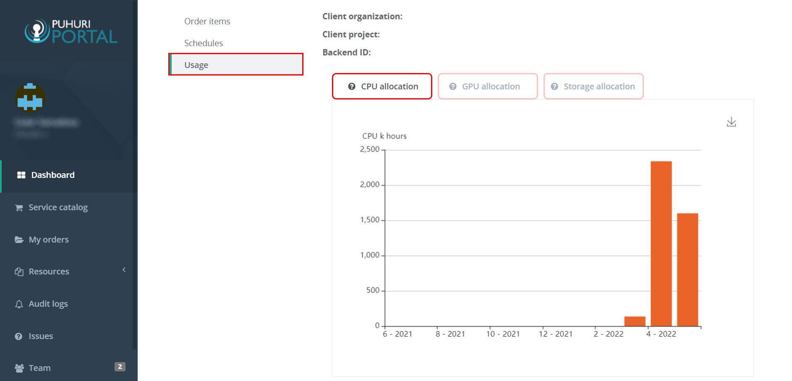
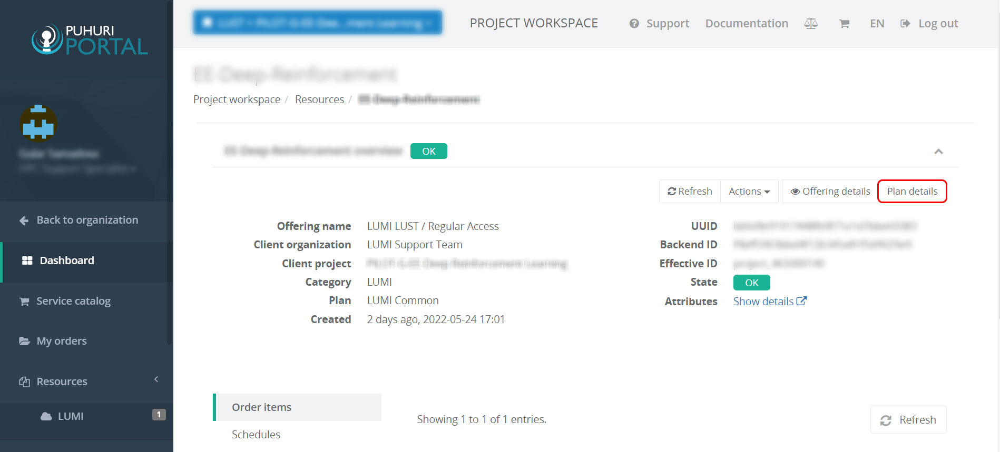
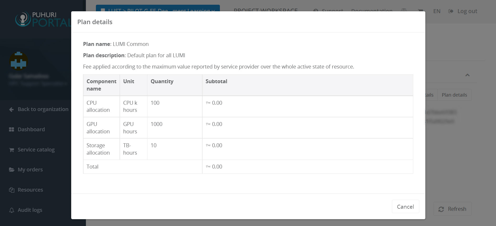

# Usage reports

Currently, in Puhuri Portal you are able to see allocations monthly usage. Allocation components (CPU, GPU and storage) are displayed on separate charts.

1. Login to Puhuri Portal using MyAccessID.
   { width="400" }

2. Open your project in Puhuri Portal.
3. Select the allocation that usage report you would like to see.
4. Click "Usage" to display the report for this allocation. Use tabs "CPU Allocation", "GPU Allocation", and "Storage Allocation" to see the details. 
   { width="600" }
   
To check the current resource allocation limit:

1. Make sure of being in your Project Workspace 
 
  { width="600" }
  
2. Click "Plan Details" to see the plan details for Allocation components (CPU, GPU, and storage).
  
  { width="600" }
