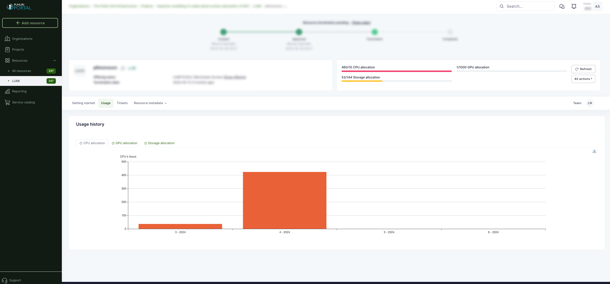

# Usage reports

Currently, in the Puhuri Portal, you can see monthly allocation usage. Allocation components (CPU, GPU and storage) are displayed on separate charts.

1. Open your project in the Puhuri Portal.
2. Select the allocation (resource) that usage report you would like to see.
3. Select the "Usage" tab from the top menu to see the report for this allocation. Use tabs "CPU Allocation", "GPU Allocation", and "Storage Allocation" to see the resource component details. 
   
   
To check the current resource allocation limit:

1. In the same view, there is a progress bars section where you can see the overall usage compared to the allocation size of different resource components.
