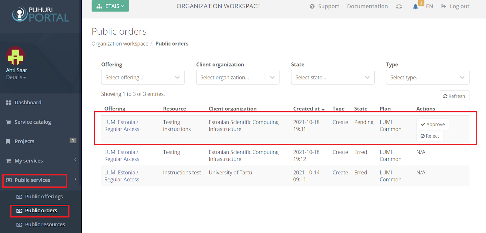

# Projects and allocations approval process

!!! note
    Following processes are only allowed to national resource allocator representatives!

## Approving project and allocation creation requests

1. Login to Puhuri Portal using MyAccessID.
   { width="400" }

2. Select allocating organization from the "Select workspace" list.
3. Click on “Public services” -> “Public orders” and then click “Approve”
   

## Approving project and allocation update requests

1. Login to Puhuri Portal using MyAccessID.
   { width="400" }

2. Select allocating organization from the "Select workspace" list.
3. Click on “Public services” -> “Project updates” and then click “Approve”
   

!!! abstract "Feedback" 
    We welcome feedback from our users - it helps us to continually improve. Please send an email with your suggestions to [support@puhuri.io](mailto:support@puhuri.io).
